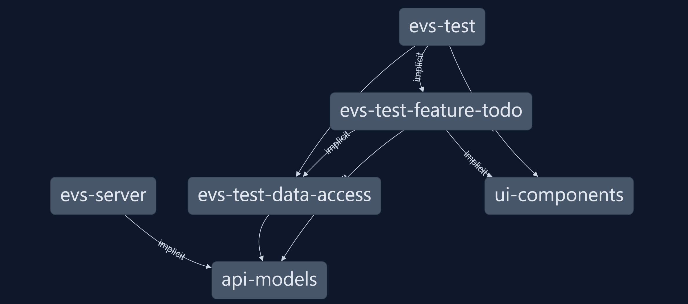
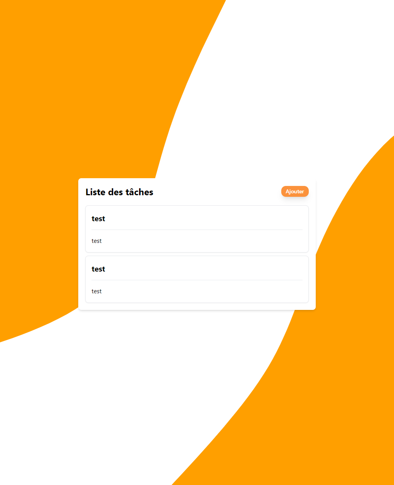

# EST Test Application
## Technologies
- Angular 18
- Tailwind
- Nx
- Ngrx signal store

## Quality
- a library based modular architecture with strict boundaries between the libraries and apps 

- Unit tests
- Typescript everywhere even on the server side
- Responsive design

## If I had more time 
- E2E tests
- Design system creation with storybook
- More features and a more complex design
- Compodoc documentation
- More abstraction on the store so we can unplug it easily when necessary
- add i18n and dark mode

## How to launch
- ``docker-compose up``
- to manipulate the backend : http://localhost:8072/api/todos ( or just load the evs_test.postman_collection.json file in your postman or bruno)
- to access the frontend : http://localhost:8090/taches/liste

